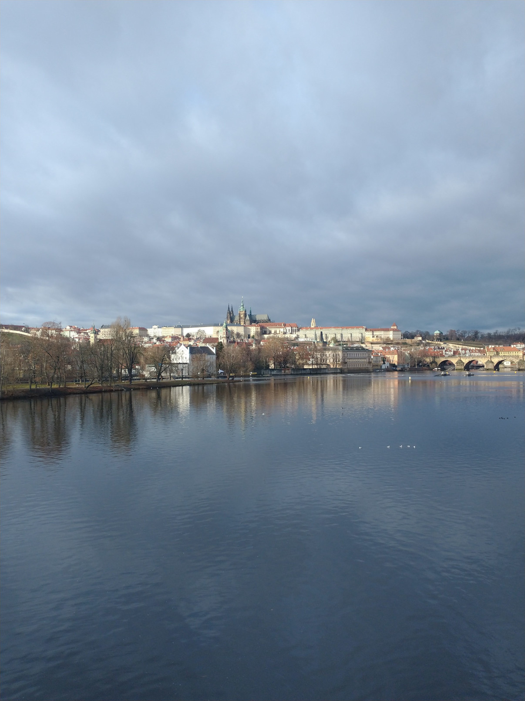

# ImFun
Convert an image to cartoon!

## Setup
Curently both the installation and development setup require [Poetry](https://python-poetry.org/)
to be installed. Once the repository is cloned, one can setup everything with
```bash
make setup
```

## Usage
In an active environment, one can run the `imfun` app to convert an image to a cartoon like this
```
$ imfun -i examples/prague-castle.png -o examples/prague-castle-cartoon.png
Converting image 'examples/prague-castle.png'
Cartoon image saved as 'examples/prague-castle-cartoon.png'
```

## Examples


